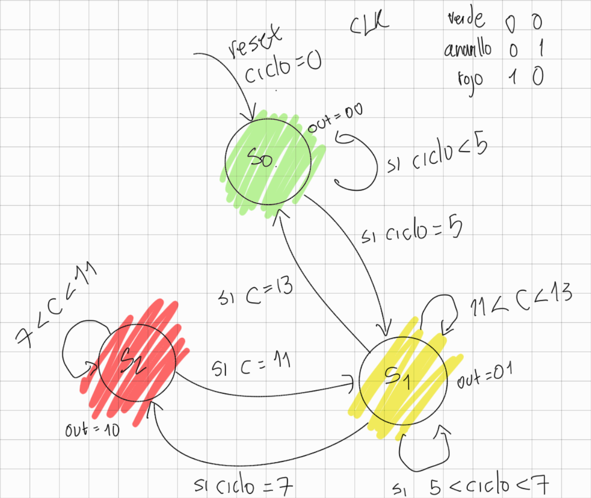
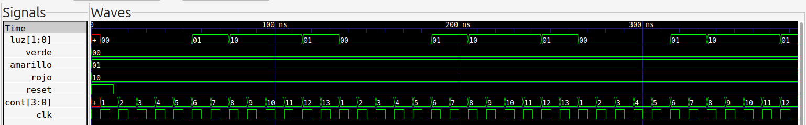
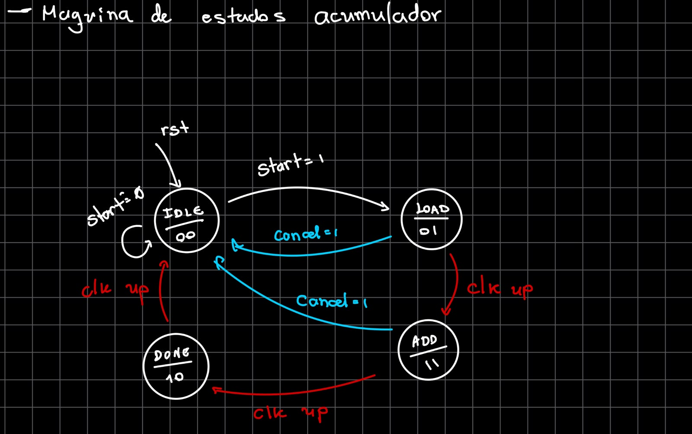
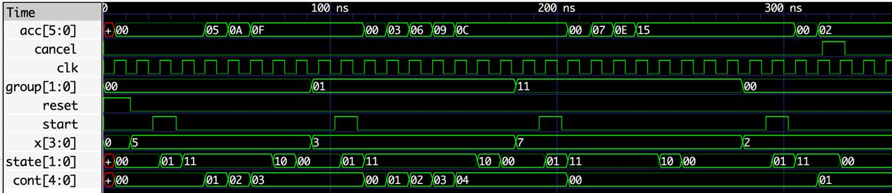

# Laboratorio 00  
## Introducción a Verilog, Simulación y Máquinas de Estados Finitos (FSM)

---

## Integrantes

- Juan Sebastián Florez Payares
- Juan Esteban Barrera Ortiz
- Carlos Andrés Herrera Molina
- Luciano Manrique Medina

**Grupo de trabajo: 3**  
**Semestre:** 2026-1  

---

## Índice
- [Laboratorio 00](#laboratorio-00)
  - [Introducción a Verilog, Simulación y Máquinas de Estados Finitos (FSM)](#introducción-a-verilog-simulación-y-máquinas-de-estados-finitos-fsm)
  - [Integrantes](#integrantes)
  - [Índice](#índice)
  - [Ejercicio 1: FSM de control – Semáforo simple](#ejercicio-1-fsm-de-control--semáforo-simple)
    - [Diseño implementado](#diseño-implementado)
    - [Simulación](#simulación)
      - [Evidencias](#evidencias)
    - [Conclusiones](#conclusiones)
  - [Ejercicio 2: FSM con datapath – Acumulador secuencial](#ejercicio-2-fsm-con-datapath--acumulador-secuencial)
    - [Diseño implementado](#diseño-implementado-1)
    - [Simulación](#simulación-1)
      - [Evidencias](#evidencias-1)
    - [Conclusiones](#conclusiones-1)

---

## Ejercicio 1: FSM de control – Semáforo simple

### Diseño implementado

El objetivo era diseñar un semáforo vehicular que cambiara de estados de la forma verde-amarillo-rojo y luego rojo-amarillo-verde, dándole a cada estado una duración de ciclos de reloj definida.

Para este ejercicio se escogió diseñar una Maquino de Estados Finitos (FSM) de arquitectura Moore. Primero se planteó el diagrama de estados según las reglas del ejercicio:

* Solo una salida puede estar activa a la vez.
* El sistema inicia siempre en el estado **Verde** después de un reset.
* La transición entre estados ocurre automáticamente al cumplirse el número de ciclos asignado.




Donde los estados definidos y su duración fueron los siguientes:

- S0: Luz verde - 5 ciclos
- S1: Luz amarilla - 2 ciclos
- S2: Luz roja - 4 ciclos

Como son 3 estados, definimos el número de bits necesarios para representarlos usando $2^n \geq 3$, entonces el número de bits necesarios es $n = 2$. Con esto se tiene a $Q_1$ y $Q_0$ como los bits de estados.

| Q1 | Q0 | Estado Siguiente |
| :---: | :---: | :---: |
| 0 | 0 | S0 |
| 0 | 1 | S1 |
| 1 | 0 | S2 |
| 1 | 1 | X |


En [semaforo.v](./Ejercicio1_FSM_Semaforo_Simple/semaforo.v) se describe el funcionamiento completo de este sistema. En general lo que se hizo fue definir las entradas como lo muestra la tabla de arriba, y como salida se definió un vector de dos bits llamado ```luz```.

```
module semaforo(
    input clk,
    input reset,
    output reg [1:0] luz
);
```

También se asignaron los nombres a los estados.

```
localparam verde    = 2'b00;
localparam amarillo = 2'b01;
localparam rojo     = 2'b10;
```

De igual manera, se declararon 2 registros: ```cont``` con el fin de llevar la cuenta de los ciclos de reloj y ```state``` con el objetivo de guardar el estado actual del semáforo.

```
reg [3:0] cont;
reg [1:0] state;
```

Con esto más adelante pudimos definir correctamente el cambio de estado según los ciclos de reloj. 

Luego, se creó la lógica secuencia usando un bloque ```always @(posedge clk) begin``` que se ejecuta cada vez que clk tenga un flanco positivo.

Dentro de este bloque, primero se tuvo en cuenta el reset, donde en caso de activarse, el sistema vuelve a su estado inicial, que es verde, y además se reinicia el contador.

```
if (reset) begin
    state <= verde;
    cont  <= 1;
end
```

si no se activa el reset entonces el contador empieza a funcionar.

```
else begin
    cont <= cont + 1;
```

En este momento es donde se usaron condicionales que compararan el ciclo de reloj con el número de ciclos de duración de cada estado. Por ejemplo para el caso de Verde se tiene:

```
if (cont < 5) begin
    state <= verde;
end
```
y la misma lógica para el resto de estados.

```
else if (cont == 5) begin
  state <= amarillo;
end
else if (cont == 7) begin
  state <= rojo;
end
else if (cont == 11) begin
  state <= amarillo;
end
else if (cont == 13) begin
  state <= verde;
  cont<=1;
end
```

Donde se cumple la secuencia de un semáforo simple verde-amarillo-rojo-amarillo-verde.

Luego, definimos otro bloque ```always```donde simplemente asignamos el estado actual a ```luz```

```
always @(*) begin
    luz = state;
end
```
---
### Simulación

Para la simulación de [semaforo.v](./Ejercicio1_FSM_Semaforo_Simple/tb_semaforo.v) creamos un modulo ```tb_semaforo``` y le decimos las señales que vamos a modificar, que son el clock y el reset; mientras que la salida va a ser el vector ```luz```.

```
module tb_semaforo;
  reg clk, reset;
  wire [1:0] luz;
```
Luego creamos un dispositivo bajo prueba (dut) que es el que conecta las entradas y salida del testbench con el semáforo.


```
semaforo dut (
    .clk(clk),
    .reset(reset),
    .luz(luz)
  );
```

Después generamos un ciclo de reloj donde cada flanco dure $5ns$, por lo que su periodo es de $10ns$. Y además lo negamos para que empiece en el flanco positivo.

```
always #5 clk = ~clk;
```

Antes de simular, configuramos para que el clock empiece en cero, el reset empiece en activo, y el tiempo de simulación sea de $400ns$.

```
initial begin
  $dumpfile("semaforo.vcd");
  $dumpvars(0, tb_semaforo);

  clk   = 0;
  reset = 1;
  #12 reset = 0;
  #400 $finish; 
end
```

En [tb_semaforo.v](./Ejercicio1_FSM_Semaforo_Simple/tb_semaforo.v) se describe el funcionamiento completo del testbench.


#### Evidencias 
A continuación se muestran las señales de entrada, salida y clock leídas con GTKWave.


Dentro de las señales observadas tenemos la de ```luz``` que es la que representa al semáforo, también observamos las señales de los colores con el fin de comparar si la secuencia es la correcta.

Podemos ver que el ```cont``` se activa en cada flanco positivo de ```clk```. También que el contador va de $1$ hasta $13$ debido a que en ese valor el contador se reinicia. Además, se puede observar un "delay" en los vectores de ```luz``` y ```cont``` debido justamente a que el primer flanco positivo empieza en $5ns$.

Finalmente verificando la señal ```luz``` confirmamos que la secuencia es la deseada: después del reset se activa el verde que se mantiene durante 5 ciclos del clk, luego se activa el amarillo que tiene una duración de 2 ciclos y luego durante 4 ciclos más se activa el rojo, para después pasar a amarillo por 2 ciclos y a verde por 5 ciclos más, y repetir esta secuencia.

---
### Conclusiones

- Se logró diseñar e implementar una FSM de Moore para controlar por ciclos las luces de un semáforo simple y seguir la secuencia verde-amarillo-rojo-amarillo-verde.
- Se aprendió que ``` always @(posedge clk)``` se usa para realizar cambios de estado sincronizados al clock.
- Se implementó un testbench correctamente con el que se pudo verificar el correcto funcionamiento de sistema. También se resalta su importancia ya que este tipo de simulaciones permiten detectar errores y corregirlos antes de alguna implementación física.


---

## Ejercicio 2: FSM con datapath – Acumulador secuencial

### Diseño implementado

El objetivo de este ejercicio fue diseñar un acumulador secuencial controlado por una Máquina de Estados Finitos (FSM), capaz de sumar un valor de entrada `x` durante varios ciclos de reloj.

Para integrar las diferentes variantes propuestas en un mismo diseño, se utilizó la entrada `group[1:0]`, que permite seleccionar el tipo de acumulación que se desea realizar. También se agregó la señal `cancel`, que permite cancelar una operación mientras se encuentra en ejecución.

La máquina de estados implementada se muestra a continuación:



La FSM cuenta con cuatro estados:

- **IDLE:** espera a que se active la señal `start`.
- **LOAD:** inicializa el acumulador y el contador en cero.
- **ADD:** realiza la acumulación de `x` de acuerdo con el valor de `group`.
- **DONE:** indica que la operación terminó y posteriormente regresa a `IDLE`.

Los estados fueron codificados utilizando dos bits:

| Estado | Código |
| :---: | :---: |
| IDLE | `00` |
| LOAD | `01` |
| ADD | `11` |
| DONE | `10` |

En [acumulador.v](./Ejercicio2_Acumulador_Secuencial/acumulador.v) se describe el funcionamiento completo del sistema. Inicialmente se definieron las entradas y la salida del acumulador:

```verilog
module acumulador(
    input  clk,
    input  start,
    input  reset,
    input  cancel,
    input  [1:0] group,
    input  [3:0] x,
    output reg [5:0] acc
);
```

Luego se definieron los registros internos. `cont` se utiliza para contar el número de sumas realizadas y `state` almacena el estado actual de la FSM.

```verilog
reg [4:0] cont;
reg [1:0] state;

localparam idle = 2'b00;
localparam load = 2'b01;
localparam add  = 2'b11;
localparam done = 2'b10;
```

Toda la lógica del sistema se ejecuta en los flancos positivos del reloj mediante:

```verilog
always @(posedge clk) begin
```

En caso de activar `reset`, la máquina regresa al estado `idle` y tanto el contador como el acumulador se inicializan en cero.

```verilog
if (reset) begin
    state <= idle;
    cont  <= 0;
    acc   <= 0;
end
```

Cuando el sistema se encuentra en `idle`, espera la señal `start`. Si `start` se activa y no existe una cancelación, la FSM pasa al estado `load`.

```verilog
if (state==idle && start && !cancel) begin
    state <= load;
end
```

El estado `load` se utiliza para inicializar el acumulador antes de comenzar las operaciones. En este estado `acc` y `cont` se llevan a cero y posteriormente la máquina pasa a `add`.

```verilog
else if (state==load && !cancel) begin
    acc   <= 0;
    cont  <= 0;
    state <= add;
end
```

Por esta razón existe un pequeño retardo entre la activación de `start` y el comienzo de la acumulación. Este comportamiento es intencional, ya que primero se pasa por el estado `LOAD` para garantizar que el acumulador se encuentre inicializado en cero antes de realizar la primera suma.

Una vez en el estado `add`, el funcionamiento depende de `group`. Se utilizaron tres valores para implementar las diferentes variantes del ejercicio:

| `group` | Operación |
| :---: | :--- |
| `00` | Sumar `x` 3 veces |
| `01` | Sumar `x` 4 veces |
| `11` | Sumar `x` hasta que `acc >= 20` |

Para `group = 00`, el contador permite realizar tres acumulaciones:

```verilog
else if (state==add && group==2'b00 && !cancel) begin
    if (cont < 3) begin
        acc  <= acc + x;
        cont <= cont + 1;
    end
    else begin
        state <= done;
    end
end
```

Para `group = 01` se utiliza la misma lógica, pero se realizan cuatro acumulaciones:

```verilog
else if (state==add && group==2'b01 && !cancel) begin
    if (cont < 4) begin
        acc  <= acc + x;
        cont <= cont + 1;
    end
    else begin
        state <= done;
    end
end
```

Finalmente, para `group = 11` no se utiliza un número fijo de sumas. En este caso se continúa acumulando `x` mientras `acc` sea menor que 20.

```verilog
else if (state==add && group==2'b11 && !cancel) begin
    if (acc < 20) begin
        acc <= acc + x;
    end
    else begin
        state <= done;
    end
end
```

También se implementó la señal `cancel`. Si se activa durante los estados `load` o `add`, la operación se interrumpe y la FSM regresa al estado `idle`.

```verilog
else if (state==load && cancel) begin
    state <= idle;
end

else if (state==add && cancel) begin
    state <= idle;
end
```

Cuando una operación termina normalmente, la máquina llega al estado `done` y posteriormente regresa a `idle`, quedando lista para recibir una nueva señal `start`.

```verilog
else if (state==done) begin
    state <= idle;
end
```

---

### Simulación

Para verificar el funcionamiento de [acumulador.v](./Ejercicio2_Acumulador_Secuencial/acumulador.v) se creó el testbench [tb_acumulador.v](./Ejercicio2_Acumulador_Secuencial/tb_acumulador.v).

Primero se definieron las señales utilizadas en la simulación y se conectaron con el dispositivo bajo prueba (`dut`).

```verilog
reg        clk, reset, start, cancel;
reg  [1:0] group;
reg  [3:0] x;
wire [5:0] acc;

acumulador dut (
    .clk(clk),
    .start(start),
    .reset(reset),
    .cancel(cancel),
    .group(group),
    .x(x),
    .acc(acc)
);
```

Al igual que en el ejercicio anterior, se generó un reloj con un periodo de $10ns$:

```verilog
always #5 clk = ~clk;
```

Al comienzo de la simulación se activa `reset` para garantizar que la FSM inicie en `IDLE` y que el acumulador se encuentre en cero.

```verilog
clk    = 0;
reset  = 1;
start  = 0;
cancel = 0;
group  = 2'b00;
x      = 4'd0;

#12 reset = 0;
```

Posteriormente se probaron las diferentes condiciones de funcionamiento del acumulador. Para cada operación se configura primero el valor de `x` y `group`, y después se genera un pulso en `start`.

Por ejemplo, para sumar `x = 5` tres veces:

```verilog
x     = 4'd5;
group = 2'b00;
#10 start = 1;
#10 start = 0;
#60;
```

El testbench también verifica los casos de cuatro acumulaciones, acumulación hasta alcanzar 20 y la cancelación de una operación en ejecución.

#### Evidencias

A continuación se muestran las señales obtenidas mediante GTKWave:



En la simulación se pueden observar las señales externas `start`, `reset`, `cancel`, `group`, `x` y `acc`, además de las señales internas `state` y `cont`, que permiten verificar las transiciones de la FSM y el número de acumulaciones realizadas.

En el **primer caso**, se utiliza `group = 00` y `x = 5`. Después de `start`, la FSM pasa por los estados `IDLE → LOAD → ADD`. Una vez inicializado el acumulador, se realizan tres sumas:

```text
0 → 5 → 10 → 15
```

Por lo tanto, el resultado final es `acc = 15`.

En el **segundo caso**, se utiliza `group = 01` y `x = 3`, por lo que se realizan cuatro sumas:

```text
0 → 3 → 6 → 9 → 12
```

El resultado final es `acc = 12`.

En el **tercer caso**, se utiliza `group = 11` y `x = 7`. En este caso el sistema continúa acumulando mientras `acc < 20`:

```text
0 → 7 → 14 → 21
```

Al alcanzar 21, se cumple la condición `acc >= 20` y la FSM pasa al estado `DONE`.

En GTKWave los buses se encuentran representados en hexadecimal, por lo que para este caso los valores de `acc` aparecen como `00 → 07 → 0E → 15`, siendo `15` hexadecimal equivalente a 21 decimal.

Finalmente, se prueba la señal `cancel` utilizando `group = 00` y `x = 2`. La acumulación comienza normalmente, pero al activar `cancel` durante el estado `ADD`, la FSM interrumpe la operación y regresa directamente al estado `IDLE`.

La señal `state` permite comprobar las transiciones entre los estados definidos:

```text
IDLE (00) → LOAD (01) → ADD (11) → DONE (10) → IDLE (00)
```

De esta forma se verificó tanto el funcionamiento del datapath encargado de realizar las acumulaciones como el funcionamiento de la FSM encargada de controlar cada operación.

---

### Conclusiones

- Se implementó una FSM de cuatro estados para controlar un acumulador secuencial, separando el control de la operación de acumulación realizada sobre `acc`.
- El estado `LOAD` permite inicializar el acumulador y el contador antes de realizar la primera suma, generando de manera intencional un ciclo de preparación entre `start` y el comienzo de la acumulación.
- Mediante la entrada `group` fue posible integrar en un mismo módulo las diferentes condiciones de acumulación propuestas en el ejercicio.
- La simulación en GTKWave permitió comprobar las transiciones entre `IDLE`, `LOAD`, `ADD` y `DONE`, así como verificar los resultados de las acumulaciones y el funcionamiento de la señal `cancel`.


