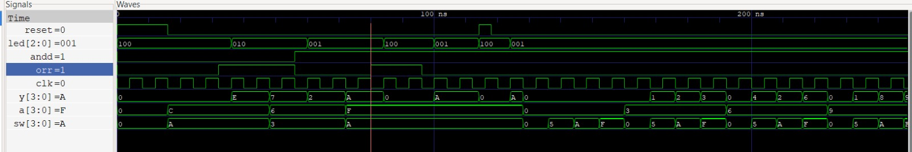
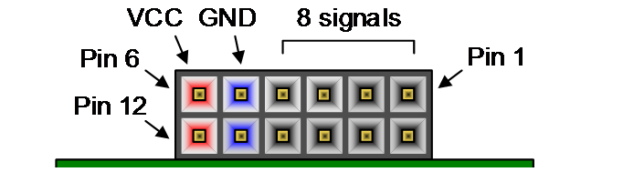

# Laboratorio 01  
## Lab01: FPGA (Zybo Z7), Vivado/Vitis y Validación de Hardware

---

## Integrantes

- Juan Sebastián Florez Payares
- Juan Esteban Barrera Ortiz
- Carlos Andrés Herrera Molina
- Luciano Manrique Medina

**Grupo de trabajo: 3**  
**Semestre:** 2026-1  

---

## Índice

- [Laboratorio 01](#laboratorio-01)
  - [Lab01: FPGA (Zybo Z7), Vivado/Vitis y Validación de Hardware](#lab01-fpga-zybo-z7-vivadovitis-y-validación-de-hardware)
  - [Integrantes](#integrantes)
  - [Índice](#índice)
  - [Ejercicio 1: Verificación Del Entorno En FPGA (Smoke Test)](#ejercicio-1-verificación-del-entorno-en-fpga-smoke-test)
  - [Ejercicio 2: Test Funcional Personalizado (Diseño libre)](#ejercicio-2-test-funcional-personalizado-diseño-libre)
    - [Diseño implementado](#diseño-implementado)
    - [¿Por qué no usamos los pulsadores que están en la FPGA?](#por-qué-no-usamos-los-pulsadores-que-están-en-la-fpga)
    - [Simulaciones](#simulaciones)
    - [Restricciones de pines (XDC)](#restricciones-de-pines-xdc)
    - [Evidencias](#evidencias)
  - [Conclusiones](#conclusiones)
  - [Referencias](#referencias)

---


## Ejercicio 1: Verificación Del Entorno En FPGA (Smoke Test)


## Ejercicio 2: Test Funcional Personalizado (Diseño libre)

### Diseño implementado

Para este ejercicio, se diseñó un sistema combinacional que consistió en realizar operaciones de `AND` y `OR` haciendo uso de pulsadores físicos de la FPGA Zybo Z7. Para esto se usaron 4 switches, 4 botones pulsadores de la FPGA, 2 switches a parte conectados a una protoboard y 5 leds RGB integrados en la placa Zybon 7z para indicar el resultado de cada operación y el estado actual de activación.

La lógica detrás de este diseño se explica en la siguiente tabla:

| Modo | Condición | y | led |
| :--- | :--- | :--- | :--- |
| AND | `andd=1, orr=0` | `a & sw` | `001` (azul) |
| OR | `andd=0, orr=1` | `a \| sw` | `010` (verde) |
| OFF | ninguno o ambos | `0000` | `100` (rojo) |

Donde `andd` y `orr` son los bits encargados de definir cada uno de los casos, y también el color del led RGB.

Es importante resaltar que los nombres `andd` y `orr` fueron escritos de esa manera debido que las palabras `and` y `or` son reservadas para la lógica de verilog.

---
### ¿Por qué no usamos los pulsadores que están en la FPGA?

La tarjeta Zybo Z7 cuenta con seis pulsadores; sin embargo, solo cuatro de ellos (BTN0 a BTN3) están conectados directamente a la parte programable de la FPGA. Los otros dos pulsadores (BTN4 y BTN5) están asociados directamente al procesador de la tarjeta, por medio de los pines MIO50 y MIO51. Por esta razón, estos dos pulsadores no se podían utilizar de la misma manera que los demás mediante una asignación de pines en el archivo .xdc.

Debido a esto, para completar las entradas necesarias en el ejercicio se utilizaron switches externos conectados a la FPGA por medio del puerto Pmod JD. Para realizar estas conexiones se utilizó una configuración pull-up, evitando que las entradas quedaran en un estado indefinido cuando los switches estuvieran abiertos.

Con esta configuración, cuando un switch se encuentra abierto la resistencia pull-up mantiene la entrada en un nivel lógico alto (1), mientras que al cerrar el switch la entrada se conecta a tierra y pasa a un nivel lógico bajo (0). De esta manera fue posible agregar las entradas necesarias al diseño sin tener que utilizar los pulsadores asociados al procesador.

---

De esta manera, se declararon las entradas, las salidas y un registro de estado actual.

```
input clk,
input andd,
input orr,
input reset,
input [3:0] a,
input [3:0] sw,
output reg [2:0] led,   // LED RGB: led[2]=Rojo, led[1]=Verde, led[0]=Azul
output reg [3:0] y      // 4 LEDs de resultado
);

// Estados: 00 = apagado/invalido, 01 = OR, 10 = AND
localparam OFF_ST = 2'b00;
localparam OR_ST  = 2'b01;
localparam AND_ST = 2'b10;

reg [1:0] state = OFF_ST;
```

Luego se describió un bloque secuencial donde se definió que en caso de que el reset esté activado, entonces `state <= OFF_ST` sin esperar el reloj; y si no, se evalúa el estado de `{andd, orr}` y se cambia de estado según eso. De esta manera se aclara también que los estados siguientes no dependen de los actuales, solo de las entrada.

```
always @(posedge clk or posedge reset) begin
    if (reset) begin
        state <= OFF_ST;
    end
    else begin
        case ({andd, orr})
            2'b10:   state <= AND_ST;  // solo andd presionado
            2'b01:   state <= OR_ST;   // solo orr presionado
            default: state <= OFF_ST;  // 2'b11 (ambos) o 2'b00 (ninguno)
        endcase
    end
end
```

Para terminar con la lógica, se implementó un bloque combinacional para asignar el estado a la salida `y` e indicar el color del led de la operación en `led`.


```
always @(*) begin
    case (state)
        AND_ST: begin
            y   = a & sw;
            led = 3'b001; // Azul
        end
        OR_ST: begin
            y   = a | sw;
            led = 3'b010; // Verde
        end
        default: begin // OFF_ST
            y   = 4'b0000;
            led = 3'b100; // Rojo
        end
    endcase
end
```


---

### Simulaciones

Luego, se generó un testbench donde primero se parte en el estado **OFF** por efecto del reset, con `y` en cero. Donde los selectores `andd` y `orr` determinan el modo: `orr` activa la operación OR, `andd` activa la AND, y cualquier otra combinación (ninguno o ambos) devuelve el sistema a OFF.

Después, el cambio de modo ocurre de forma síncrona, o sea, en el siguiente flanco de subida del reloj, mientras que la salida `y` responde de inmediato a los cambios de los operandos `a` y `sw`, sin esperar al reloj.

Cabe resaltar que el reset es asíncrono, o sea que lleva el sistema a OFF en cuanto se activa, y al soltarlo la máquina retoma el modo indicado por los selectores en el siguiente flanco de reloj. 

Finalmente en la simulación se recorre estos casos en orden: reset, OR, AND, entrada inválida, reset asíncrono; y termina con un barrido de operandos en modo AND para comprobar que `y` siempre sigue el resultado esperado. La salida de ***GTKwave*** se muestra a continuación:




### Restricciones de pines (XDC)

En [Zybo-Z7_IMPANDOR_actualizado.xdc](src/Zybo-Z7_IMPANDOR_actualizado.xdc) se realizó la asignación de los pines utilizados en la tarjeta **Zybo Z7**. En este archivo se relacionan las entradas y salidas definidas en Verilog con los elementos físicos de la tarjeta, como los switches, pulsadores, LEDs y el puerto Pmod JD.

La asignación utilizada durante la implementación se muestra en la siguiente tabla:

| Señal | Pin FPGA | Recurso en la placa | Función |
| :--- | :--- | :--- | :--- |
| `clk` | K17 | Reloj del sistema | Reloj de 125 MHz |
| `a[0]` | G15 | SW0 | Bit 0 del primer operando |
| `a[1]` | P15 | SW1 | Bit 1 del primer operando |
| `a[2]` | W13 | SW2 | Bit 2 del primer operando |
| `a[3]` | T16 | SW3 | Bit 3 del primer operando |
| `sw[0]` | K18 | BTN0 | Bit 0 del segundo operando |
| `sw[1]` | P16 | BTN1 | Bit 1 del segundo operando |
| `sw[2]` | K19 | BTN2 | Bit 2 del segundo operando |
| `sw[3]` | Y16 | BTN3 | Bit 3 del segundo operando |
| `andd` | T14 | Pmod JD0 | Selección de operación AND |
| `orr` | T15 | Pmod JD1 | Selección de operación OR |
| `reset` | P14 | Pmod JD2 | Reset del sistema |
| `y[0]` | M14 | LED LD0 | Bit 0 del resultado |
| `y[1]` | M15 | LED LD1 | Bit 1 del resultado |
| `y[2]` | G14 | LED LD2 | Bit 2 del resultado |
| `y[3]` | D18 | LED LD3 | Bit 3 del resultado |
| `led[0]` | V16 | LED6 - Rojo | Canal rojo del LED RGB |
| `led[1]` | F17 | LED6 - Verde | Canal verde del LED RGB |
| `led[2]` | M17 | LED6 - Azul | Canal azul del LED RGB |

Los cuatro switches `SW0-SW3` se utilizaron para formar el primer operando de 4 bits (`a`), mientras que los cuatro pulsadores `BTN0-BTN3` conformaron el segundo operando (`sw`). Los LEDs `LD0-LD3` permitieron observar directamente los cuatro bits del resultado.

Por otra parte, mediante el puerto **Pmod JD** se conectaron las señales externas utilizadas para seleccionar las operaciones AND y OR, además de la señal de reset. Los switches externos se conectaron utilizando la configuración *pull-up* explicada anteriormente.

Para la implementación física se utilizó el siguiente esquema de conexiones:



**Fig. 1.** Diagrama de conexiones y recursos utilizados de la placa Zybo Z7. Tomado de [1].


### Evidencias

A continuación se presenta un video del funcionamiento del diseño implementado físicamente en la tarjeta **Zybo Z7**. En este se observa el uso de los switches y pulsadores como entradas, los LEDs para mostrar el resultado de las operaciones y el LED RGB para indicar el estado actual del sistema.

[Video de la implementación en la Zybo Z7](img/Lab1video.mp4)


---

## Conclusiones

- Moraleja

---

## Referencias

[1] Digilent, “Zybo Z7 Reference Manual,” Digilent Inc. [En línea]. Disponible en: https://digilent.com/reference/programmable-logic/zybo-z7/reference-manual.

